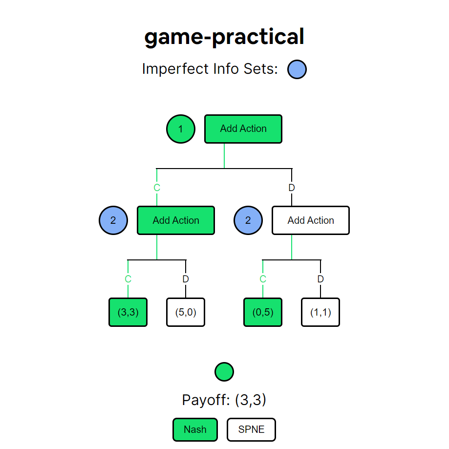

# game-practical

game-practical is an extensive form game tree solver. It can calculate the Pure Strategy Nash Equilibrium and Subgame Perfect Nash Equilibrium of any perfect and imperfect game tree which is discrete and finite.

Prisoner's dilemma - Nash equilibrium

  
   

Allocation procedure - SPNE

  
  

## Usage

- Click on the + button to add a new node.
- Choose whether the node is going to be a move or a payoff
- If the node is a move:
  - Enter the player number
  - Add all actions that the player takes from that node
- If the node is a payoff:
  - Enter the payoff for each player of the game separated by a comma (,)
- If you want to add an imperfect information set
  - Right click on all of the nodes that will be a part of that set - they should turn blue
  - Click on the Add Imperfect Info Set button to save the set
  - You can view all your imperfect info sets using the circle buttons at the top of the page
- Make sure your tree is complete before requesting a solution
- Click on the whichever solution concept you want the tree to be evaluated using (Nash / SPNE)
- Wait for the solution to load - this may take a bit of time
- Once the solution is calculated, the nodes part of the solution should turn green and the payoff for that profile should be visible
- In case of multiple solutions, you can toggle between them using the circle buttons on the bottom.

## Issues

- If the game tree isn't correctly setup, the site may throw an error or continuously keep loading failing to produce a solution.
- Due to the complexity of the algorithm, the site may take a bit of time to calculate the solution for the game tree.

If the site keeps loading for too long, it's possible that the algorithm has run into an unanticipated error. In any such cases, please raise an issue, and I'll try to fix it.
